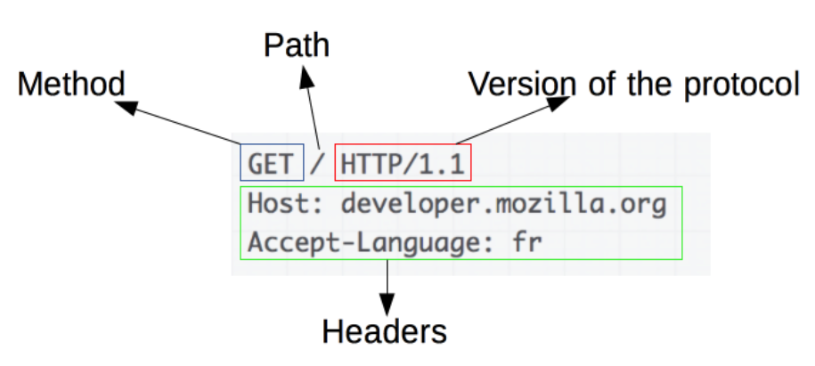
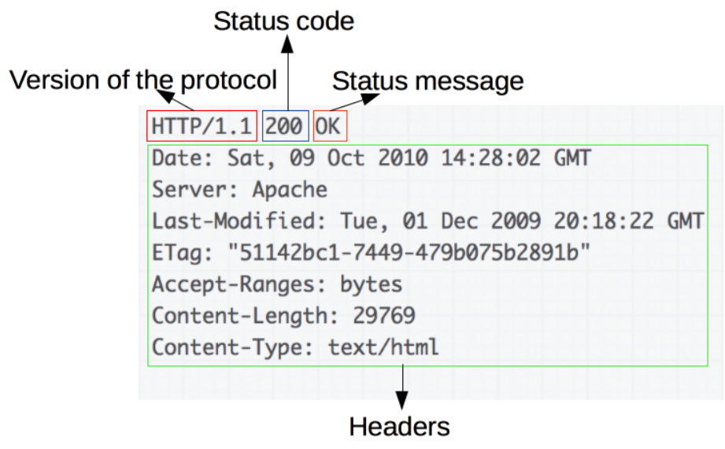
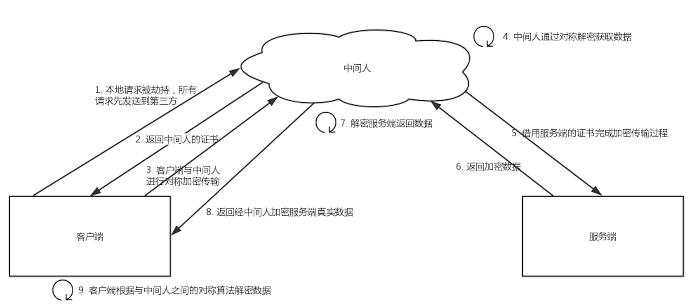
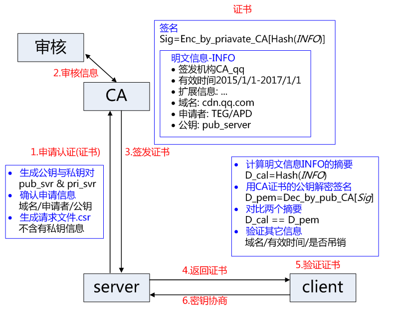

# HTTP 发展历史和特点介绍

简单、可扩展、无状态、有会话的网络通讯协议

## HTTP 0.9

- 请求为单行命令，仅有 GET

```html
GET /mypage.html
```

- 响应仅包含文档，无 HTTP 头

- 不能传输其他类型，没有状态码

```html
<HTML>
这是一个非常简单的HTML页面
</HTML>
```

## HTTP 1.0

- +引入状态码

- +引入 HTTP 头，因此具备传输其他类型数据的能力（Content - Type头）

- +每一个 HTTP 请求建立一个单独的 TCP 连接

- 请求报文：包括请求行和首部行
  
  - 请求行：方法字段、URL 字段和 HTTP 版本字段。
    - 方法字段：GET、POST、HEAD、PUT 和 DELETE等（POST 和 GET有什么区别？）



- 响应报文
  - 状态行、首部行和响应实体
  - 状态行：版本号、状态码、状态信息



- -每个TCP连接只发送一个请求，在请求需要重新建立连接

## HTTP 1.1 (1.0发布几个月后)

- +连接复用（持久连接）
- +管线化技术（流水线），下一个请求不必等上一个请求发送完即可发送（被证明无法在当前网络下实现
- +支持响应分块（被后续流的机制代替）
- +额外缓存机制 [HTTP 缓存 - HTTP | MDN](https://developer.mozilla.org/zh-CN/docs/Web/HTTP/Caching)
- +内容协商机制（Accept - \* 头）
- +host 头，不同域名可配置到同一个IP地址
- -队头堵塞，虽然TCP连接能够复用，但是必须按照次序进行通信，如果前面的回应慢就会造成后面的回应堵塞

## HTTP 2.0 (15年后)

- +二进制协议（1.1是文本协议）

- +复用协议
  
  - 流模式，数据包标记 ID
  
  - 同一连接中，可以发送不同的请求和响应，且无需按序

- +头部压缩
  
  - 使用 Gzip 压缩头部
  
  - 维护头部信息表，只发送索引号

- +允许服务器推送

- 受限于 TCP 协议，会受到网络拥塞影响，一个报文拥塞，全部报文都发不出去

## HTTP 3.0

- 基于 UDP 的 QUIC 协议
- 暂时处于草案状态

## HTTPS

克服 HTTP 明文传输的缺陷

- TLS/SSL：TLS 协议是 SSL 协议的标准化版本

- 如何握手：大致就是客户端验证服务器给出的证书，同时两方共生成三个随机数用作后续对话的加密密钥。
  
  - 第一步，客户端向服务器发起请求，请求中包含使用的协议版本号、**生成的一个随机数**、以及客户端支持的加密方法。`（协议版本+随机数+支持的加密算法）`
  
  - 第二步，服务器端接收到请求后，**确认双方使用的加密方法、并给出服务器的证书**、以及一个服务器**生成的随机数**。`（确认加密算法+证书+随机数）`
  
  - 第三步，客户端**确认服务器证书有效后**，生成一个**新的随机数**，并使用数字证书中的公钥，**加密这个随机数**，然后发给服务器。并且还会提供一个前面所有内容的 **hash 的值**，用来供服务器检验。`（CA公钥验证证书+随机数+使用证书公钥加密随机数+供检验正确性的hash）`
  
  - 第四步，服务器使用自己的私钥，来**解密客户端发送过来的随机数**。并提供前面所有内容的 hash 值来供客户端检验。`（私钥解密随机数+前面所有内容的hash值以供检验）`
  
  - 第五步，客户端和服务器端根据约定的加密方法使用前面的**三个随机数，生成对话秘钥**，以后的对话过程都使用这个秘钥来加密信息。`（利用三个随机数生成加密密钥，后续会话就用约定的算法和密钥加密）`

  ### 中间人可以伪造请求吗？
  
  - 证书由CA的私钥加密，加密内容会相应网站的信息摘要
  
  - 不可以，TLS 要求验证证书，中间人没有CA签发的证书，就算劫持了网站的证书也没有相应的CA私钥，无法实现信息篡改。




