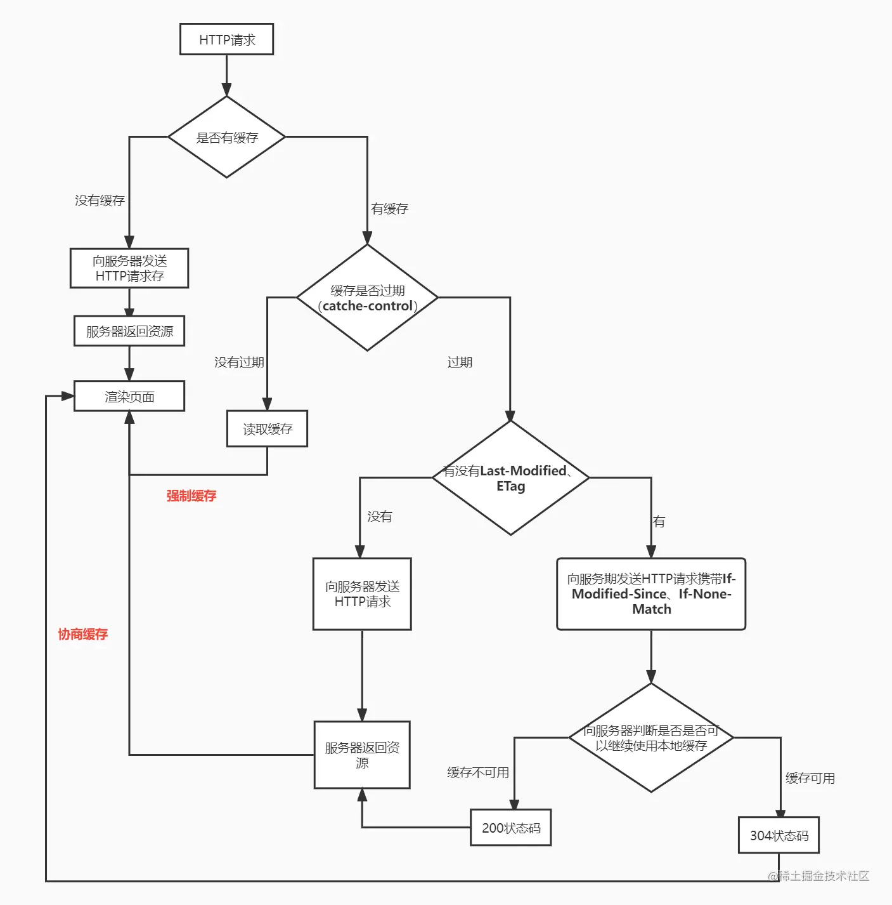
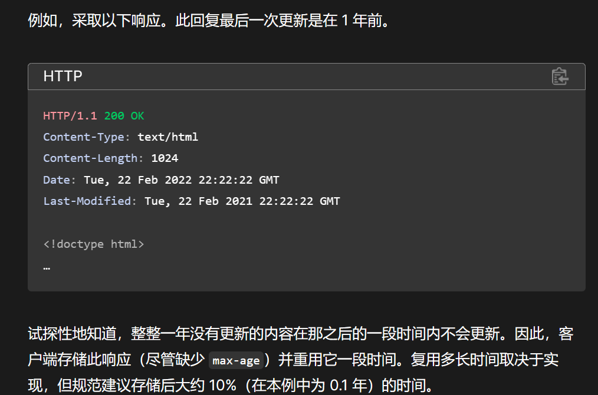
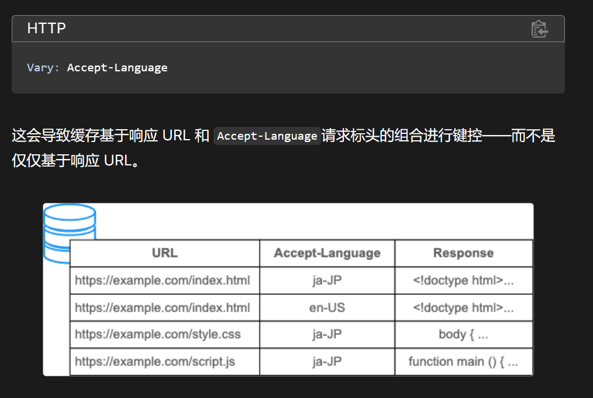

# 关于HTTP缓存

HTTP缓存可以分为：私有缓存和共享缓存。

- 共享缓存：代理缓存（Proxy）、托管缓存（CDN）
- 私有缓存：绑定到客户端的缓存，主要是浏览器。（为什么叫私有：存储个性化的响应，不与其他客户端共享。）

## 私有缓存机制

私有缓存按照机制可以分为，强制缓存和协商缓存

- 强制缓存：浏览器不向服务器发起任何请求，直接从本地缓存中读取。（实质是基于age机制的缓存）
- 协商缓存：浏览器需要向服务器发起请求询问，通过header字段判断是否命中。（实质是基于Last-modified和Etag）（针对过期和Cache-Control: no-cache）

## 缓存策略

### 启发式缓存

Http会尽可能的进行缓存，所以如果对缓存什么都不设置，也会有默认的缓存效果

### Expires 和 Max-Age（Age)

- Expires 是具体日期，存在问题（1. 粒度太小；2. 可能存在客户端与服务器时间不同步情况
- Max-Age 相对时间，最小单位毫秒
- 同时存在时 max-age 首选
- Age: 表示响应在代理缓存中存在的时间，一般都是0, 如果max-age和age都有，则强制缓存时间则为max-age 减去 age

### Etag 和 Last-Modified

- Last-Modified(响应字段) 和 If-Modified-Since（请求字段）：上次修改时间（问题，与Expires一致
- Etag 和 If-None-Match：Etag是一个资源标志符
- 同时存在时,Etag 优先
- 关于Last-Modified字段：这个头部字段不仅对缓存有用，是一个标准HTTP头，不如CMS需要用它表示资源上次修改时间等，以及其他目的。

### Vary 响应

[HTTP 缓存 - HTTP | MDN (mozilla.org)](https://developer.mozilla.org/zh-CN/docs/Web/HTTP/Caching#vary_响应)

- 区分响应本质是通过URL，但相同URL可能不一定是同样的响应内容，尤其是Accept-*内容协商头

