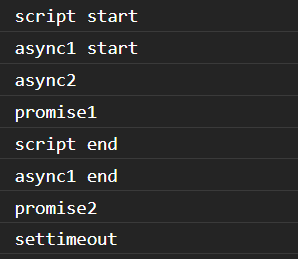
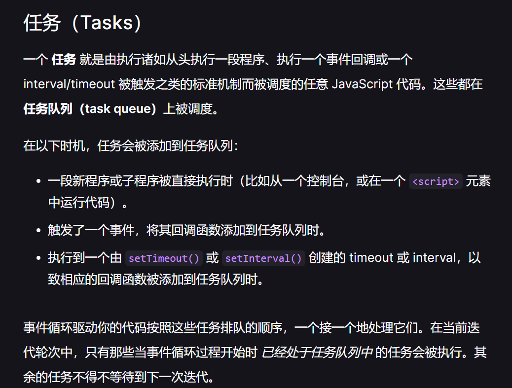

# 1. 作用域

- 动态作用域：JS 中this 指向问题类似动态作用域
- 词法作用域：JS 采用词法作用域，由变量写在哪里（被声明位置）确定其作用域（编译器分词阶段确定

# 2. 闭包

- 函数能够记住和访问当前词法作用域，当函数当前作用域之外执行，就形成了闭包

- 如果把访问当前词法作用域的函数当参数传递（回调函数）就是应用了闭包

```javascript
function wait(message) {
    setTimeout(function timer() {
        console.log(message);
    },1000);
}
```

# 3. this 指向问题

- 类似动态作用域
- new 绑定

1. 创建一个对象
2. 连接原型
3. 绑定this
4. 若return新对象，则返回新对象

```javascript
function _new(fn, ...args) {
  const newObj = Object.create(fn.prototype);
  const value = fn.apply(newObj, args);
  return value instanceof Object ? value : newObj;
}
```


- 显示绑定 (bind/apply/call)

如果你传入了一个原始值(字符串,布尔类型，数字类型)，来当做this的绑定对象，这个原始值转换成它的对象形式。

如果你把`null`或者`undefined`作为this的绑定对象传入`call`/`apply`/`bind`，这些值会在调用时被忽略，实际应用的是默认绑定规则。

- 隐式绑定(是否由上下文对象调用)

```javascript
    function foo() {
      console.log(this.a);
    }
    var a = "Oops, global";
    let obj2 = {
      a: 2,
      foo: foo
    };
    let obj1 = {
      a: 22,
      obj2: obj2
    };
    obj2.foo(); // 2 this指向调用函数的对象
    obj1.obj2.foo(); // 2 this指向最后一层调用函数的对象
    
    // 隐式绑定丢失
    let bar = obj2.foo; // bar只是一个函数别名 是obj2.foo的一个引用
    bar(); // "Oops, global" - 指向全局
	test(obj2.foo); // 传入函数的引用，调用时也是没有上下文对象。
```


- 默认绑定(严格模式为undefined，其它情况为全局对象)

```javascript
function foo() {
  console.log(this.a); // this指向全局对象
}
var a = 2;
foo(); // 2
function foo2() {
  "use strict"; // 严格模式this绑定到undefined
  console.log(this.a); 
}
foo2(); // TypeError:a undefined
```


```javascript
function foo() {
  console.log(this.a); // foo函数不是严格模式 默认绑定全局对象
}
var a = 2;
function foo2(){
  "use strict";
  foo(); // 严格模式下调用其他函数，不影响默认绑定
}
foo2(); // 2
```


- 箭头函数，回归词法作用域（最近一层的this）

# 4. 硬绑定与软绑定

- 硬绑定(bind/apply)

```javascript
// 实现一个bind
Function.prototype.myBind = function (othis, ...rest) {
  if (typeof this !== 'function') {
    throw new TypeError('not callable');
  }
  const ftoBind = this,
    fNOP = function () {},
    fBound = function (...args) {
        // 判断new 调用
      return ftoBind.apply(this.constructor === ftoBind ? this : othis, rest.concat(args));
    };
   // 连接原型
  // fNOP.prototype = this.prototype;
  // fBound.prototype = new fNOP();
    fbound.prototype = Object.create(this.prototype)
  return fBound;
};
```

- 软绑定（硬绑定无法修改this ,软绑定可以修改

```javascript
Function.prototype.softbind = function (obj, ...rest) {
  const fn = this;
  const bound = function (...args) {
    // 保留隐式绑定和显示绑定的能力
    return fn.apply(!this || this === (window || global) ? obj : this, rest.concat(args));
  };
    // 构造原型链
  bound.prototype = Object.create(fn.prototype);
};
```

# 5. `['1', '2', '3'].map(parseInt)` what & why ?

- **parseInt(\*string\*, \*radix\*)**  解析一个字符串并返回指定基数的十进制整数， `radix` 是2-36之间的整数，表示被解析字符串的基数。

```javascript
var new_array = arr.map(function callback(currentValue[, index[, array]]) {
 // Return element for new_array 
}[, thisArg])
```

- parseInt('1', 0) //radix为0时，且string参数不以“0x”和“0”开头时，按照10为基数处理。这个时候返回1
- parseInt('2', 1) //基数为1（1进制）表示的数中，最大值小于2，所以无法解析，返回NaN
- parseInt('3', 2) //基数为2（2进制）表示的数中，最大值小于3，所以无法解析，返回NaN

# 6. 深拷贝

```javascript
function deepClone(obj, depth = Infinity, objStack = []) {
  function getKeyVals(obj) {
    // 获取包括Symbol在内的所有属性
    return [...Object.keys(obj), ...Object.getOwnPropertySymbols(obj)].map((key) => [
      key,
      obj[key]
    ]);
  }

  if (depth <= 0 || objStack.includes(obj)) {
    // 处理循环引用
    return null;
  }

  if (obj instanceof Date) {
    // 处理时间
    return new Date(obj);
  }
  if (Array.isArray(obj)) {
    // 处理数组
    return obj.map((o) =>
      typeof o === 'object' ? deepClone(o, depth - 1, objStack.concat([obj])) : o
    );
  }
  // 快速浅克隆
  const ret = Object.assign({}, obj);
  getKeyVals(ret).forEach(([key, val]) => {
    // 处理需要深克隆的情况
    if (typeof key === 'object') {
      ret[key] = deepClone(val, depth - 1, objStack.concat([obj]));
    }
  });
}
```

# 7. 数据类型

- 基本类型：Number / Boolean / String / Null / Undefined / BigInt / Symbol，存放在栈中
- 复杂类型：Object 存放在堆中

# 8. 异步

- 概念：事件循环、宏任务、微任务 / Promise 、生成器、setTimeout
- [在 JavaScript 中通过 queueMicrotask() 使用微任务 - Web API 接口参考 | MDN (mozilla.org)](https://developer.mozilla.org/zh-CN/docs/Web/API/HTML_DOM_API/Microtask_guide)

```javascript
async function async1() {
  console.log('async1 start'); // 2
  await async2();
  console.log('async1 end');// 6
}
async function async2() {
  console.log('async2'); // 3
}
console.log('script start'); // 1
setTimeout(function () {
  console.log('settimeout'); // 8
});
async1(); 
new Promise(function (resolve) {
  console.log('promise1'); // 4
  resolve();
}).then(function () {
  console.log('promise2'); // 7
});
console.log('script end'); // 5
```






JavaScript 中的 [promise](https://developer.mozilla.org/zh-CN/docs/Web/JavaScript/Reference/Global_Objects/Promise) 和 [Mutation Observer API](https://developer.mozilla.org/zh-CN/docs/Web/API/MutationObserver) 都使用微任务队列去运行它们的回调函数，但当能够推迟工作直到当前事件循环过程完结时，也是可以执行微任务的时机。为了允许第三方库、框架、polyfill 能使用微任务，在 [`Window`](https://developer.mozilla.org/zh-CN/docs/Web/API/Window) 和 [`Worker`](https://developer.mozilla.org/zh-CN/docs/Web/API/Worker) 接口上暴露了 [`queueMicrotask()`](https://developer.mozilla.org/zh-CN/docs/Web/API/queueMicrotask) 方法。

任务队列和微任务队列的区别很简单，但却很重要：

- 当执行来自任务队列中的任务时，在每一次新的事件循环开始迭代的时候运行时都会执行队列中的每个任务。在每次迭代开始之后加入到队列中的任务需要*在下一次迭代开始之后才会被执行*。
- 每次当一个任务退出且执行上下文栈为空的时候，微任务队列中的每一个微任务会依次被执行。不同的是它会等到微任务队列为空才会停止执行——即使中途有微任务加入。换句话说，微任务可以添加新的微任务到队列中，这些新的微任务将在下一个任务开始运行之前，在当前事件循环迭代结束之前执行。

# 9. 数组扁平化

```javascript
function flat(arr) {
  const lst = [];
  if (Array.isArray(arr)) {
    arr.forEach((item) => {
      if (Array.isArray(item)) {
        const tmp = flat(item);
        lst.push(...tmp);
      } else {
        lst.push(item);
      }
    });
  }
  return lst;
}

// 自带方法
Array.prototype.flat()
Array.prototype.flatMap()
```

# 10. JWT JSON Web Token

- 三个部分组成：1. header 2. payload 3. signature

- 如何编码：Base64(header) . Base64(payload) . 加密算法(base64(header)+‘.’+base64(payload), secret)

- 如何验证：在服务端对token中的 header 和 payload重新加密，比对签名

- 如何防止篡改：secret只保存在服务端，如果发生篡改，对header payload加密后，比对会失败

- payload中的内容：签发者、面向的用户、过期时间、签发时间、jwt id等还可以加一些业务逻辑相关内容。

# 11. 跨域

- 同源策略：协议、域名、端口号一致，不同源的js脚本不能操作数据

# 12. decodeURI() decodeURIComponent()

encodeURI()主要用于整个URI(例如，[http://www.baidu.com/search](https://link.zhihu.com/?target=http%3A//www.baidu.com/search)  value.html)，而encode-URIComponent()主要用于对URI中的某一段(例如前面URI中的search value.html)进行编码。它们的主要区别在于，**encodeURI()不会对本身属于URI的特殊字符进行编码，例如冒号:、正斜杠/、问号?和井号#**；**而encodeURIComponent()则会对它发现的任何非标准字符进行编码**。

# 
