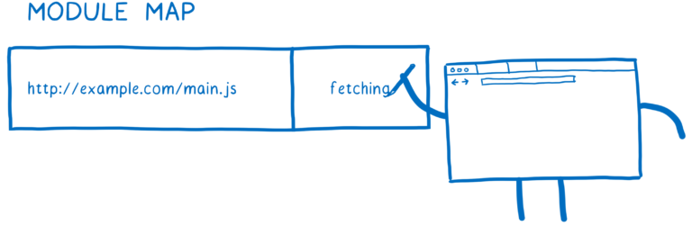
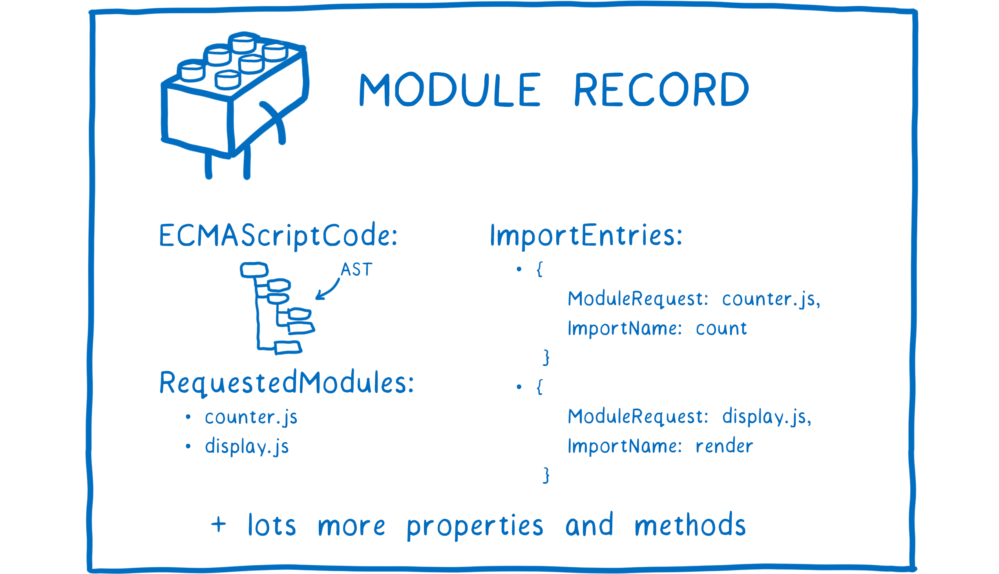
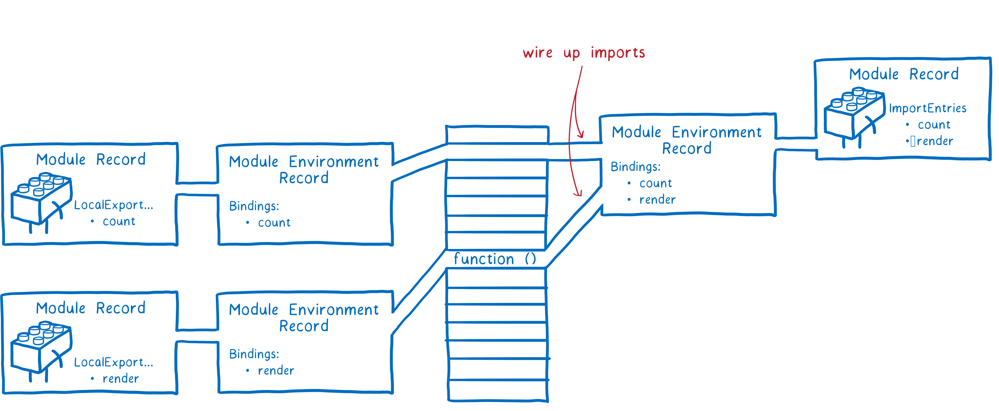
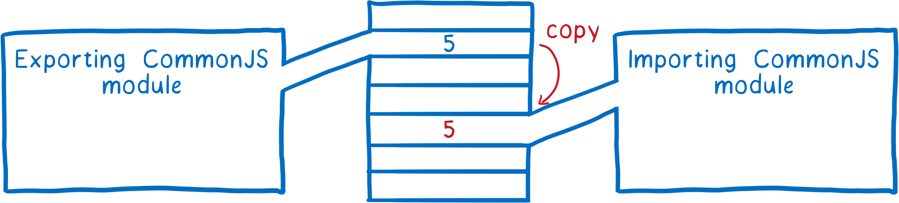
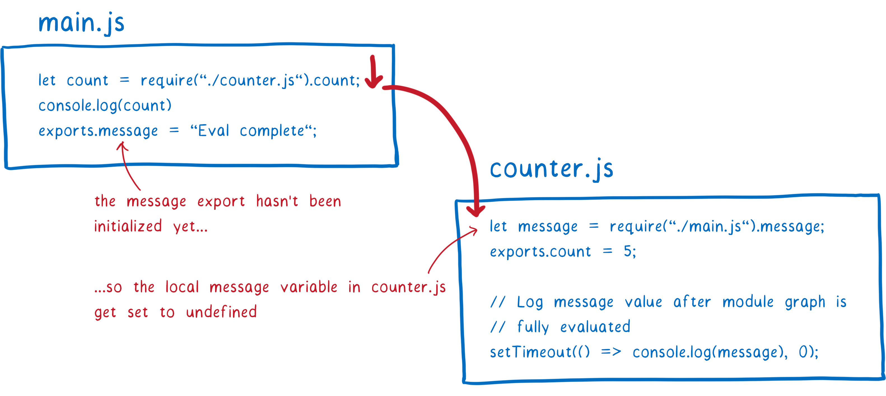
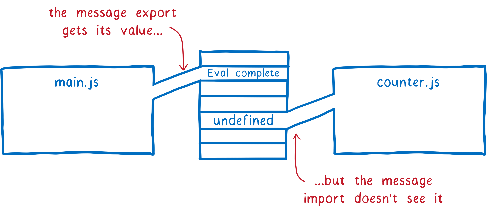

# 为什么需要模块化

- 更好的组织变量和函数
- 实现低耦合，高内聚，更好地维护代码

# ESModule如何工作

- 主流模块化方案有两种，CommonJS 和 EcmaScript Module，这里介绍ESM的工作原理。

- 主要分为三个阶段：构建、实例化、评估（Evalutaion）

## 1. 构建

- 找到应该去哪里获取模块文件

- 下载模块文件

- 解析文件为模块记录（一种应用于模块的数据结构）

### 1.1 寻找模块文件

- 先找到入口 main.js

- 通过 import 语句找到其依赖模块

### 1.2 使用模块加载器下载模块文件

- 加载器会构造一个 Module Map（Map 中的模块会被缓存）

- 发送请求获取一个模块文件

- 添加键值，URL 和 fetching

- 继续下一个模块文件

- 当获取到相同的模块文件时，略过

### 1.3 解析模块

- 获取模块文件后，将其解析为模块记录，一种描述模块的数据结构，用于帮助浏览器理解模块信息和它们之间的区别。
  
  - 模块解析使用严格模式
  
  - 模块文件解析需要在 script 标记 type=“module”

- 一旦模块记录被创建，就会被置入 Module Map 的值中，替代 fetching，用作模块索引

## 2. 实例化

实例化即结合代码和状态，而状态存于内存中，所以实例化过程即为写入内存的过程。

1. JS 引擎创建模块环境记录（用于管理模块记录中导出的变量）

2. 为导出的变量连接内存空间（环境记录会持续跟踪联系导出变量和内存空间）
   
   1. 内存空间中暂时还不会被写入数据值，只是占有空间，在第三步评估中才会进行写值
   
   2. 实例化采用深度优先的后序遍历，保证过程中从完全不需要依赖的模块开始

3. 为导入连接内存空间，导入和导出的变量连接到同一个内存空间（与CJS的不同点）

## 3. 评估（运行代码）

运行顶层代码（函数体外的代码），获取模块变量值，写入内存

- 所有的模块代码应该只被运行一次，否则可能造成潜在副作用，这也是为什么使用 Module Map 对模块记录进行缓存的原因之一，可以保证它只被运行一次。

- 依然是深度优先的后序遍历

# CommonJS与ESModule的区别

## 1. 同步与异步

- ESM为异步执行，而CJS是同步执行

- CJS主要在node服务端使用，所有的模块文件保存在本地，同步执行阻塞情况较少

- ESM主要在浏览器端使用，模块文件需要下载，很可能遭遇阻塞，因此需要异步

## 2. 引用与值的拷贝

- CJS在导出模块变量时，使用值的浅拷贝

- ESM的模块变量，导入与导出，连接同一块内存区域，这一点也体现在循环依赖的处理上

## 3. 循环依赖处理

以一个简单的循环依赖为例

- 从main.js出发，进入counter.js，遭遇循环引入

- 将message设置为undefined

- 向下运行，导出count变量，返回main.js，继续运行，导出message，主线程结束

- 消息队列中的代码运行，打印message，值仍为undefind（而不是Eval complete）

- 原因：CJS导出值的浅拷贝

相反，ESM最终的打印值为Eval complete，因为引用同一块内存区域。

# 参考文献

[ES modules: A cartoon deep-dive - Mozilla Hacks - the Web developer blog](https://hacks.mozilla.org/2018/03/es-modules-a-cartoon-deep-dive/)
