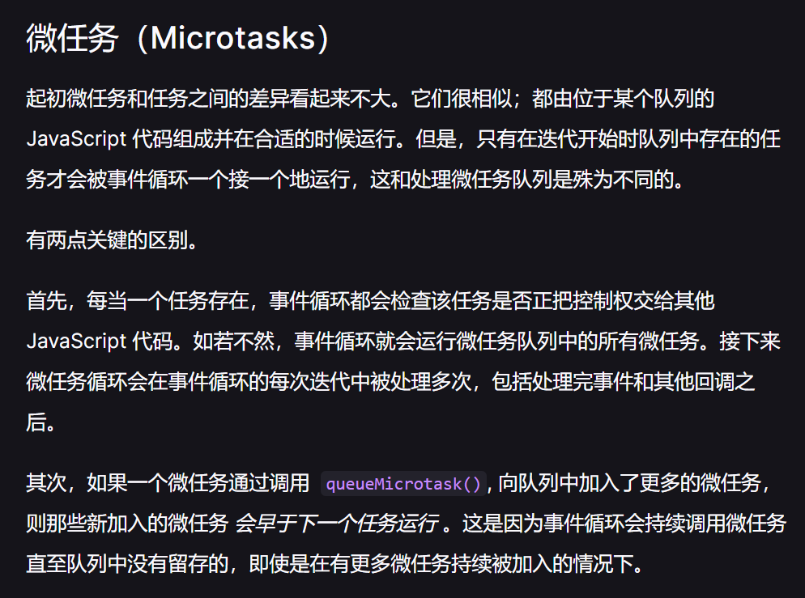

# JavaScript运行时 

1. JS代码执行时，JS运行时实际维护了一组代理
2. 每个代理 = 执行上下文 + 上下文栈 + 主线程 + worker的额外线程 + 任务队列 + 微任务队列

# 事件循环

事件循环用于驱动代理，收集事件 - 给任务排队 - 执行等待中的任务 - 执行微任务 - 在下一次循环前执行必要的渲染和绘制

三种事件循环：window / worker / worklet

多个同源窗口运行在相同的事件循环中

特定情况下共享事件循环：

- 一个窗口打开了另一个窗口，可能共享

- iframe 会和包含它的窗口共享

- 多进程浏览器中多个窗口碰巧共享同一进程

# 任务和微任务

任务队列入队时机：执行一段程序、触发事件时添加回调函数、执行timeout或者interval添加回调函数 

JavaScript 中的 [promise](https://developer.mozilla.org/zh-CN/docs/Web/JavaScript/Reference/Global_Objects/Promise) 和 [Mutation Observer API](https://developer.mozilla.org/zh-CN/docs/Web/API/MutationObserver) 都使用微任务队列去运行它们的回调函数，但当能够推迟工作直到当前事件循环过程完结时，也是可以执行微任务的时机。为了允许第三方库、框架、polyfill 能使用微任务，在 [`Window`](https://developer.mozilla.org/zh-CN/docs/Web/API/Window) 和 [`Worker`](https://developer.mozilla.org/zh-CN/docs/Web/API/Worker) 接口上暴露了 [`queueMicrotask()`](https://developer.mozilla.org/zh-CN/docs/Web/API/queueMicrotask) 方法。

任务队列和微任务队列的区别很简单，但却很重要：

- 当执行来自任务队列中的任务时，在每一次新的事件循环开始迭代的时候运行时都会执行队列中的每个任务。在每次迭代开始之后加入到队列中的任务需要*在下一次迭代开始之后才会被执行*。
- 每次当一个任务退出且执行上下文栈为空的时候，微任务队列中的每一个微任务会依次被执行。不同的是它会等到微任务队列为空才会停止执行——即使中途有微任务加入。换句话说，微任务可以添加新的微任务到队列中，这些新的微任务将在下一个任务开始运行之前，在当前事件循环迭代结束之前执行。

## 执行顺序

- 每次事件循环开始时，先执行任务队列，再执行微任务队列
- 任务队列在执行完毕后，必须等待下一次事件循环才能执行
- 在本次循环中增加到微任务队列的微任务，会在本次循环中执行完

