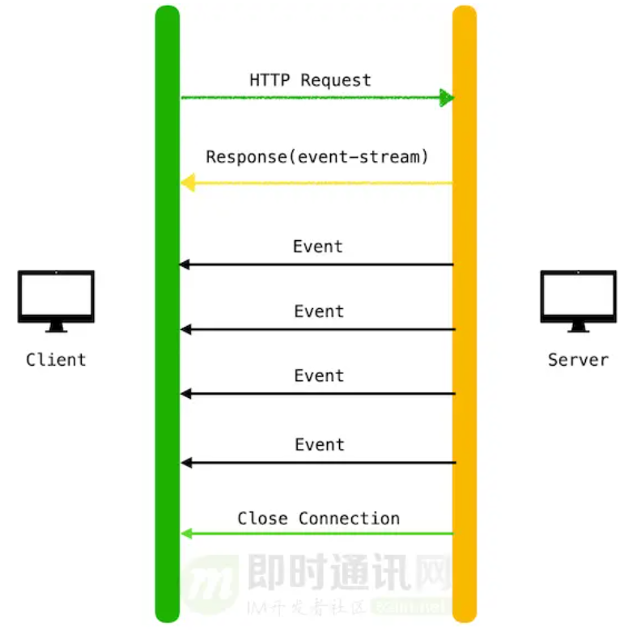

# SSE和EventSource

- SSE：Sever-Sent Events

## 介绍下SSE

服务器发送事件，一种主动推送手段，包括浏览器的EventSource对象和HTTP协议

本质是一个HTTP长连接，但不是发送一个数据包还是一个事件流（content-type: text/evnet-stream)

## 优点

- 基于HTTP协议，兼容性好，轻量化，使用简单
- 能够断线重连，不需要向websocket一样手动

## 缺点

- 服务端单向推送，websocket是全双工
- 只能用于文本，websocket支持二进制数据

## 使用

- 实例化EventSource对象
- 监听message事件

## HTTP 2.0

在非HTTP2.0协议下，SSE会受到浏览器最大并发数限制，限制到很低（6）的水平

HTTP2.0情况下，这个最大并发数由服务器和浏览器协商，默认为100