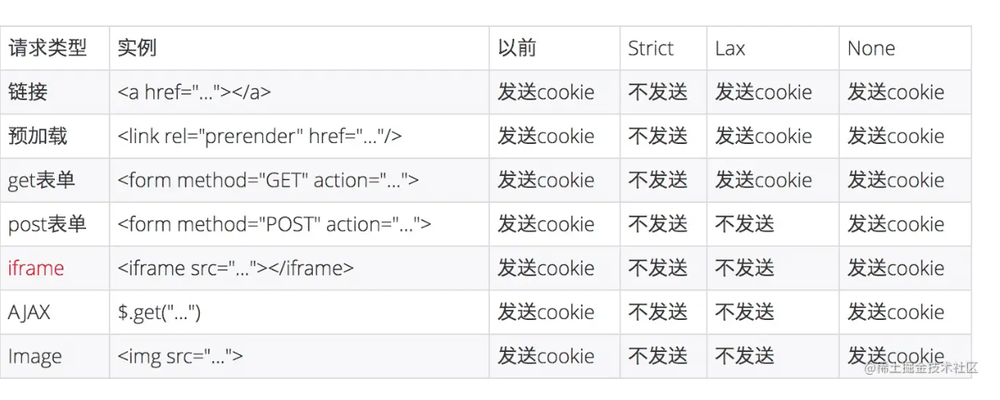

# 关于Cookie跨域

- 设置withCredentials
- 服务端设置Access-control-allow-orign & Access-control-allow-credentials
- same-site 默认为 lax，跨站情况需要设置same-site: none，而这个又必须要secure，即仅https

跨站一定跨域，跨域不一定跨站

同站标准：顶级域名（eTLD)和它之前的部分，(eTLD+1)相同

