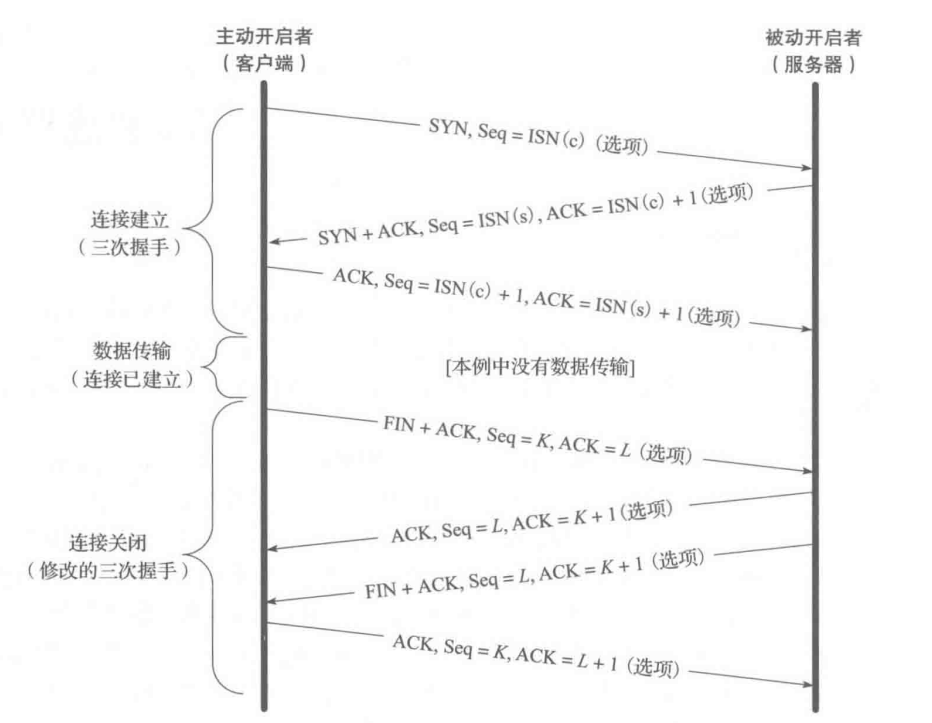
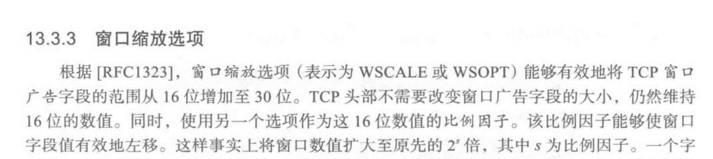
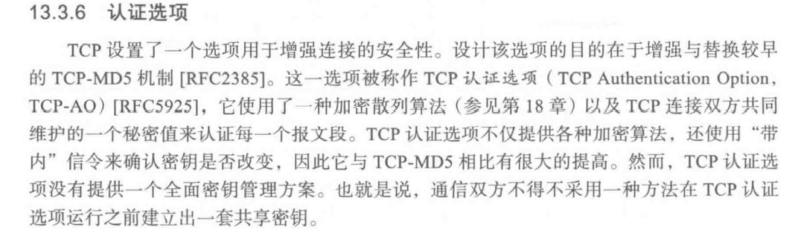
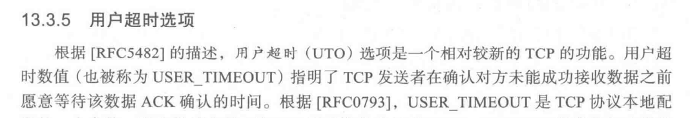
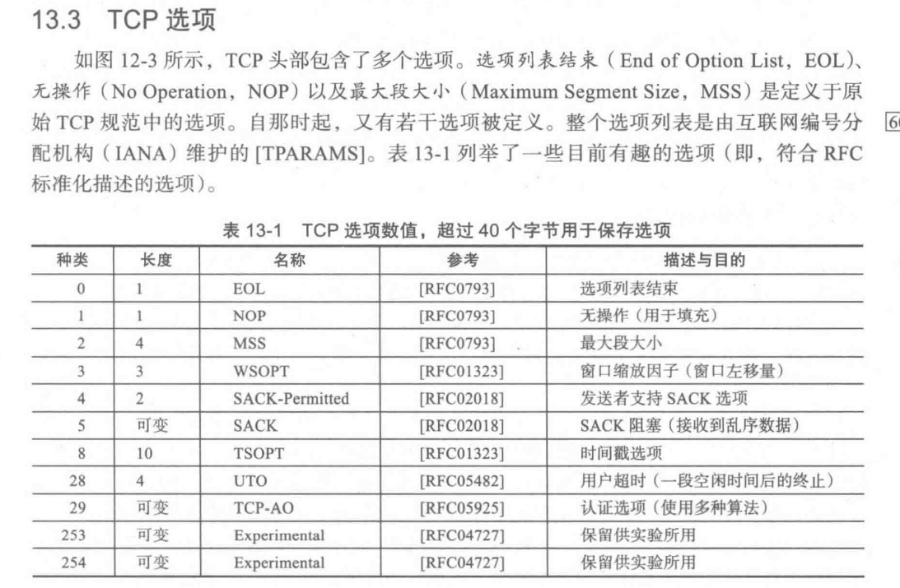

# OSI七层模型、五层模型、TCP/IP协议族

1. OSI：物理-数据链路-网络-传输-会话-表示-应用
2. 五：物理-数据链路-网络-传输-应用
3. TCP/IP：网络接口层-网络层-传输层-应用层

# TCP/UDP

## 1. TCP

- TCP是一个**有连接**、**保证可靠交付**的传输层协议
- 是一个全双工，点对点的协议
- 传输前需要三次握手建立连接，需要维护连接状态，传输结束需要四次挥手断开连接
- 通过**序号、确认号、重传、检验和**等机制保证可靠交付
- 有**流量控制**和**拥塞控制**
- 头部20字节固定字段，4n可选字段
- 基于TCP的协议：HTTP、FTP、SMTP

### 超时重传、快速重传

- 超时：TCP每发送一个报文段，对其设置一个定时器，若定时器设置时间到达还没有接收到确认报文，就重传
- 快速：收到三个相同ACK即重传

### 流量控制

滑动窗口：

- 每个数据包都有一个序列号，接收方收到数据包以后会返回确认信息，发送发根据确认信息，更新窗口，向前滑动并更改窗口大小
- 滑动窗口本质是一个缓冲区，发送完成以后的数据包会留在缓冲区，确认以后从缓存区删除

### 拥塞控制

四种方法：慢启动、拥塞避免、快速重传和快速恢复

- 慢启动：每接收一个ACK，拥塞窗口+1，每一个RTT，窗口翻倍
- 拥塞避免：窗口到达慢启动阈值时启用，每一个RTT，窗口+1
- 快速重传：用于丢包检测，收到三次ACK，快速重传
- 快速恢复：检测到丢包，拥塞窗口减半

### tcp 一方服务器断线会发生什么？

[网络编程6：TCP连接断电或程序崩溃会发生什么？ - 知乎 (zhihu.com)](https://zhuanlan.zhihu.com/p/581877778)

1. 有数据传输：会发生重传，重传到最大次数之前上线则恢复正常，否则另一方会断开连接。若在线方已经断开，当断线方重新上线发送数据会收到RST报文，则断线方也会断开连接。
2. 无数据传输：没有数据无法探知连接情况，keep-alive机制，双方存在计时器，到时间还没有数据传输，则发送探测报文
3. 进程崩溃：TCP状态由内核维护，进程崩溃，内核可以感知到，会正常向对方四次挥手断开连接

## 2. UDP

- UDP是一个**无连接、不可靠、尽力交付**的**传输层协议**，只提供传输层最低限度的功能（复用、分解和少量的差错检验），适合对**实时性能要求高**的场景
- UDP传输之前**不需要建立连接**，也不需要在传输时保持连接
- UDP提供的是尽力交付功能，**不保证数据的可靠交付**（可靠交付：无差错、不丢失、无重复、按序）
- 首部有一个**校验和字段**，但是只能检错不能纠错
- **没有流量控制和拥塞控制**
- 报文首部只有**源端口和目的端口**，支持一对一、一对多、多对一、多对多等
- 报文首部只有8个字节
- 多应用于流媒体相关
- 基于UDP协议有，DNS、TFTP、QUIC等

# HTTP

# 1. 三次握手 / 四次挥手



- 三次握手
  
  - 主动开启方发送SYN报文段, 包含SYN字段和初始序列号(往往是随机的)
  
  - 被动方收到后, 发送自己的SYN报文段, 包含SYN字段, 自己的初始序列号和对主动方的ACK信号 = 主动方 Seq + 1
  
  - 主动方收到被动方SYN报文段后, 发送对被动方SYN报文段的ACK报文, 包含 +1 的己方序列号和作为ACK的对方序列号

- ACK (Acknowledgement) = 期望对方发送的序列号

- 四次握手
  
  - 主动关闭方发送FIN报文段, 包含对最后一次接收报文的ACK信号和己方的序列号以及FIN信号
  
  - 被动关闭方接收到主动方FIN报文段后, 发送一个对该报文的ACK报文, 包含己方序列号和对对方的ACK序列号
  
  - 完成主动方的连接关闭, 形成半关闭状态, 此时被动方仍然可以发送数据到主动关闭方
  
  - 被动关闭方发送自己的FIN报文段, 包含己方序列号和对对方的ACK序列号, 除FIN信号外与对主动方FIN报文确认的ACK报文段相同
  
  - 主动方收到被动方FIN报文段后, 最后发送一个确认报文段, 等待2MSL(2倍最大存活时间)

- 建立连接握手时还会携带哪些信息? 
  
  - 最大报文段
  
  - 选择确认选项
  
  - 窗口缩放选项
  
  - 时间戳和防绕回序列号(重传计时用)
  
  - 用户超时选项
  
  - 认证选项









# 2. Get Post 区别

1. 一般来说，GET用于获取资源，POST用于提交资源

2. 传参方式不同，GET采用URL，POST采用 request BODY

3. URL长度限制，GET有限制，POST一般不受限(该限制为服务器制定)

4. 参数类型不同，GET只能有使用 ASCII ，POST 无类型限制

5. 缓存机制，GET会被缓存，POST不会，除非手动

# 3. Cookie Token的区别

[傻傻分不清之 Cookie、Session、Token、JWT - 掘金 (juejin.cn)](https://juejin.cn/post/6844904034181070861)

- Cookie：用于HTTP协议维护状态

- Token：用于鉴权，登录以后，服务端生成返回TOKEN存储在客户端，每次请求API时都携带（放Header里）TOKEN，用于鉴权

# 4. 浏览器缓存

- 浏览器可以使用在一段时间内保存的请求副本，有效期内可以不向服务端请求

- 两种，强缓存和协商缓存
  
  - 强缓存，在有效期内直接使用缓存，不向服务端请求，由服务端向http响应头中添加expires或cache-control字段控制，cache-control优先级更高，
  - 协商缓存，由服务器决定，先发送一个请求头，资源未修改则返回304

- Last-modified（响应头的字段）: 协商缓存中使用，帮助服务器了解缓存是否够新，后续请求发送时，会在请求头中添加 if-modified-since 字段（请求头的字段）判断资源是否变化，未变化则返回304 NOT MODIFIED，变化则返回请求中更新last -modified字段，变化则返回 200

- E-TAG：与 last - modified类似，后续请求也会发送 if - none -match，判断文件是否变更

- **为什么要有Max-age**：Expires返回到期的时间是服务器时间，如果服务器和客户端时间差别很大就会产生问题。

- **为什么有了 last-modified还要e-tag**，因为
  
  - 某些文件可能会周期性更改，但并不修改文件内容
  - 某些文件会频繁修改，粒度小于秒这个last-modified的最小单位
  - 某些服务器不能精确得到最后修改时间
  - 总而言之，last-modified精度较小，是一个备用项

- cache-control值：更全面
  
  - 可缓存性：
    
    - no - cache : 不使用强缓存
    
    - no - store：不使用缓存
    
    - public：表明响应可以被任何对象（包括：发送请求的客户端，代理服务器，等等）缓存，即使是通常不可缓存的内容。（例如：1.该响应没有`max-age`指令或`Expires`消息头；2. 该响应对应的请求方法是 [POST](https://developer.mozilla.org/zh-CN/docs/Web/HTTP/Methods/POST) 。）
    
    - private：表明响应只能被单个用户缓存，不能作为共享缓存（即代理服务器不能缓存它）。私有缓存可以缓存响应内容，比如：对应用户的本地浏览器。
  
  - 到期：
    
    - max-age：周期
    
    - s-maxage：覆盖`max-age`或者`Expires`头，但是仅适用于共享缓存(比如各个代理)，私有缓存会忽略它。
    
    - max-stale：表明客户端愿意接收一个已经过期的资源。可以设置一个可选的秒数，表示响应不能已经过时超过该给定的时间。
    
    - min-fresh：表示客户端希望获取一个能在指定的秒数内保持其最新状态的响应。
  
  - 重新验证和加载
    
    - must-revalidate：一旦资源过期（比如已经超过`max-age`），在成功向原始服务器验证之前，缓存不能用该资源响应后续请求。
    
    - proxy-revalidate：与must-revalidate作用相同，但它仅适用于共享缓存（例如代理），并被私有缓存忽略。
  
  - 其他：
    
    - no-transform：不得对资源进行转换或转变。`Content-Encoding`、`Content-Range`、`Content-Type`等HTTP头不能由代理修改。
    
    - only-if-cached：表明客户端只接受已缓存的响应，并且不要向原始服务器检查是否有更新的拷贝。

# 5. 如何跨域

## 1. iframe类型的跨域

主要基于iframe

- 通过document.domain 设置相同的主域名，就可以实现对iframe页面操作和cookie访问

- window.name , name属性在不同页面和域下加载后依然存在，不修改就不会发生改变，同时name可以存储2MB，需要一个同源的中间页面进行代理，因为不同源，先在a页面中使用iframe加载不同源的b页面（该页面中修改name值来传递），加载成功后修改iframe的location为同源的中间页面C，在a页面中获取iframe的name

- location.hash，与name类似，但是通过hash值传递，iframe嵌套，a-b-c，b与a不同域，c与a同域。使用window.parent.parent.callback调用在a中定义的回调函数

## 2. H5 PostMessage 跨域

- postMessage是HTML5 XMLHttpRequest Level 2中的API，且是为数不多可以跨域操作的window属性之一，它可用于解决以下方面的问题：
  
  - a.） 页面和其打开的新窗口的数据传递
  - b.） 多窗口之间消息传递
  - c.） 页面与嵌套的iframe消息传递
  - d.） 上面三个场景的跨域数据传递

- 用法：postMessage(data,origin)方法接受两个参数
  
  - data： html5规范支持任意基本类型或可复制的对象，但部分浏览器只支持字符串，所以传参时最好用JSON.stringify()序列化。
  - origin： 协议+主机+端口号，也可以设置为"*"，表示可以传递给任意窗口，如果要指定和当前窗口同源的话设置为"/"。

- a.html：(http://www.domain1.com/a.html)
  
  - ```html
    <iframe id="iframe" src="http://www.domain2.com/b.html" style="display:none;"></iframe>
    <script>       
        var iframe = document.getElementById('iframe');
        iframe.onload = function() {
            var data = {
                name: 'aym'
            };
            // 向domain2传送跨域数据
            iframe.contentWindow.postMessage(JSON.stringify(data), 'http://www.domain2.com');
        };
    
        // 接受domain2返回数据
        window.addEventListener('message', function(e) {
            alert('data from domain2 ---> ' + e.data);
        }, false);
    </script>
    ```

- b.html：(http://www.domain2.com/b.html)
  
  - ```html
    <script>
        // 接收domain1的数据
        window.addEventListener('message', function(e) {
            alert('data from domain1 ---> ' + e.data);
    
            var data = JSON.parse(e.data);
            if (data) {
                data.number = 16;
    
                // 处理后再发回domain1
                window.parent.postMessage(JSON.stringify(data), 'http://www.domain1.com');
            }
        }, false);
    </script>
    ```

## 3. CORS

## 4. node服务器代理

## 5. nginx反代理

## 6. WebSocket协议

## 7. JSONP

- 动态创建Script，在src中拼接调用的函数名和参数

- 后端传回 JSON后，Script直接加载执行回调函数

- 缺点，只能使用get参数
