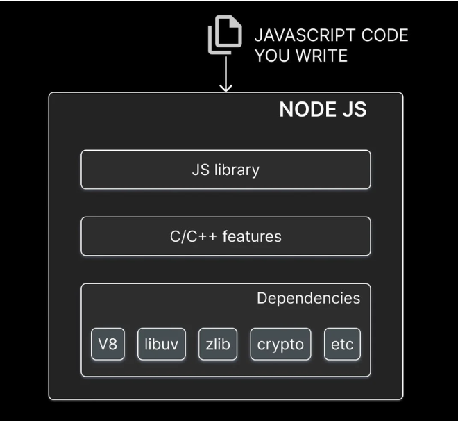
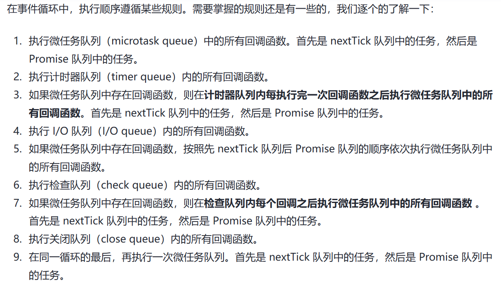
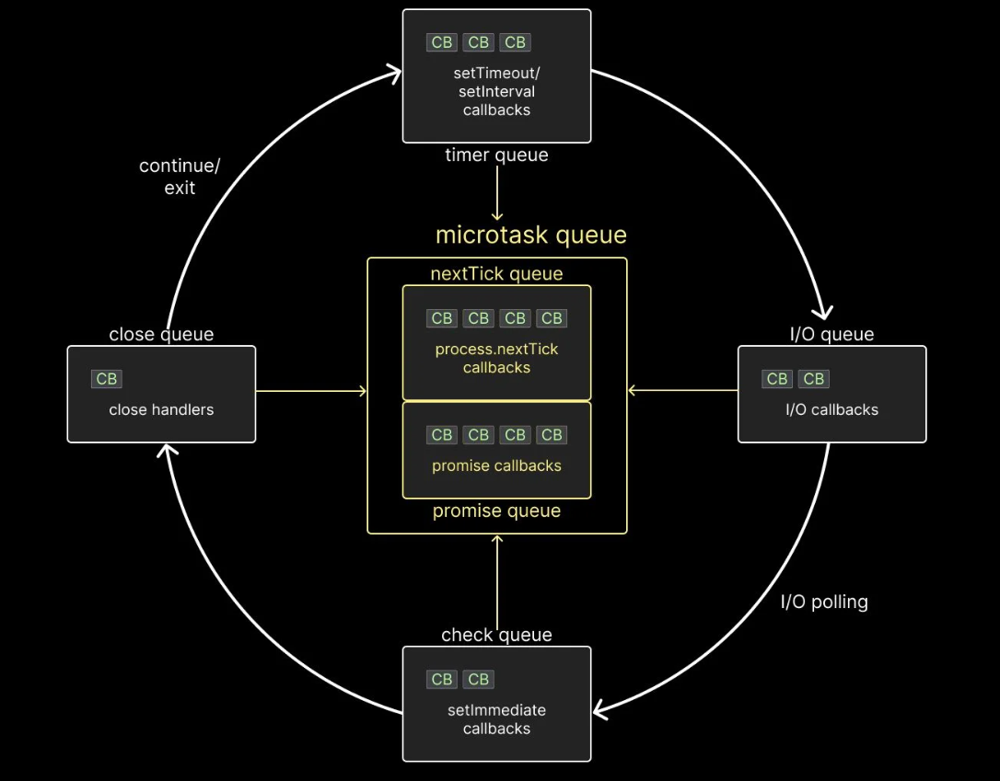

# Node相关知识点

## Node.js本体

### 什么是Node.js

基于V8引擎的 js 运行时

### NODE 应用场景

高并发

I/O密集型

衍生问题：为什么适合高并发和I/O密集型

### 前端常用来做什么

自动化构建工具、中间层

### NODE的架构/结构

JS 库：调用C/C++代码

C/C++ 功能：调用文件系统、网络之类的

底层的依赖：V8/libuv/zlib/crypto 等

### libuv是什么

是一个c语言编写的跨平台工具库，主要作用就是提供异步操作的支持

### NODE 事件循环

NODE进程启动时会创建一个循环，这个循环中会查看事件队列中的队列、取出事件、执行回调，每一次循环都被称作一次TICK

### 事件循环与浏览器中的事件循环有什么区别

NODE中的任务分成了好几种类型，放在不同的任务队列中，不同的任务队列在执行顺序上有区别。

一共有六种队列，宏任务有四种队列，timers / io / check / close

微任务有两种队列，tick / promise（微任务队列异步任务不属于libuv

- timers: setTimeout/setInterval 的回调任务
- io: fs http 模块之类的，IO任务
- check: setImmediate 的回调任务，**这是NODE特定的功能**
- close: 异步关闭事件相关的回调任务

- tick: process.nextTick
- promise

### 事件循环的顺序

总结：分成六个队列，四个宏任务队列（timer io check close)，两个微任务队列(tick promise)，循环最开始会检查一次微任务队列，依次，检查四个宏任务队列，然后每**次宏任务回调执行完成以后会再检查微任务队列**，循环的最后再检查一次微任务队列。

特殊情况：

1. setTimeout（cb, 0）时，其实是setTimeout(cb, max(0,1))，计时器延迟最小为1ms，所以存在io再timer前的情况 
2. io轮询，虽然io任务完成了，但是由于没有被轮询到，所以第一次循环到io队列的时候，里面可能是空的。

### 异步回调任务执行的时机

异步任务回调任务的执行时机，当前调用栈为空的时候才会去执行异步回调

### exports 和 module.exports 的区别

[模块化之export&export default&module.exports&exports的使用与区别 - 掘金 (juejin.cn)](https://juejin.cn/post/7267206305147600932#heading-3)

module.exports 和 exports 指向同一块内存，exports 其实就是 module.exports 的一个引用，为了方便 module.exports 对象添加属性和赋值之类的操作

## express 框架相关

